# 嘉信理财美股期权从 0 到 1 教程：基础概念、开通权限与 thinkorswim 买卖实操

这可能是全网最简单、最通俗易懂的一期嘉信理财美股期权教程，帮助你在 20 分钟左右，一次性搞懂美股期权的基本概念，并使用嘉信理财的 thinkorswim，从头到尾完整实操一遍具体的期权操作，轻松入门。

一个多月之前，我给大家做过一期[嘉信理财从 0 到 1 入门的基础攻略](https://invest-nav.com/tutorials/us-brokers/text/charles-schwab-thinkorswim-guide/)，把网站以及 App 上常见的一些功能，以及具体的交易流程完整讲解了一遍。不过因为时间关系，我们跳过了美股期权相关的讲解以及实操。

今天我就把这块内容给大家补上，争取用 20 分钟的时间，带你轻松入门嘉信理财的期权功能。全程都会使用 thinkorswim 这个嘉信理财旗下的官方交易平台给大家演示。

新来的观众朋友，可以先去看一遍上期教程，简单了解、学习一下。话不多说，我们尽快开始。

::after-hook

## 1. 期权是什么？买卖白菜的故事

首先，我们需要先学习一下期权到底是什么。像是我们在美股市场中买某只股票的期权，最后买到的其实是一份权利，它允许我们在约定的时间范围内，按照约定的价格买入或者卖出对应的股票。

直接听起来可能会有些抽象。这里我们可以用一个农民种菜、卖菜的例子，来通俗易懂地理解一遍。假设有个农民叫做王富贵，他今年种了一批白菜，等再过一个月就可以收获了，现在白菜的价格是每斤 5 块钱。

然后，有一个菜贩子叫李发财，准备在一个月之后找王富贵买 100 斤白菜。

但是这个李发财就很担心，万一一个月之后白菜涨价了，自己的进货成本就会比现在高很多。

他灵机一动，决定和老王商量一下：“能不能这样，我先给你 50 块钱，一个月之后，无论白菜涨到什么价格，我都能找你按照现在的价格，也就是每斤 5 块钱，买走你这里的 100 斤白菜。”

“到时候如果我不想买的话，也可以不买，现在给你的这 50 块钱也就不退了，咱们白纸黑字提前写清楚。”

老王听完之后，心里想：“这也挺不错的，不管最后白菜价格涨或者跌，我都能先收到一笔钱，相当于保险费了。”

于是，这两个人按照之前商量好的，签下了关于买卖白菜的协议。

然而，在一个月之后，白菜的价格真的涨了，涨到了每斤 8 块钱。

这个时候，李发财就可以带着之前签好的协议，给老王支付 500 块钱，低价把这 100 斤白菜全部买走。

同样数量的白菜，直接从市场上购买的话，需要 800 块钱。而在签了这份协议之后，老李只需要花 500 块钱，再加上之前支付的 50 块钱，总共 550 块钱就可以买到，最后节省了 250 元。

而对于王富贵来说，虽然他提前收到了 50 块钱的“保险费”，但是也错过了白菜价格的上涨。算下来，相比直接按市场价卖，是少赚了。但协议已经签了，白纸黑字写得清清楚楚，他也没办法反悔，只能按约定的低价卖出了。

我们回过头来看，这个故事其实背后反映的就是**看涨期权**的概念，英文名叫做 **Call**。

李发财支付的 50 块钱，在这个故事里面可以叫做保险费，但在期权的概念中，它的专业名词是**权利金**。

双方约定每斤 5 块钱的白菜价格，叫做**行权价（Strike）**；一个月后到期的约定日期，叫做期权的**到期日**。

而李发财最后拿着这份协议，按照每斤 5 块钱的价格买走王富贵的白菜，这个动作叫做**行权**。

但如果一个月之后，白菜并没有涨价，反而跌到每斤 3 块钱呢？

李发财直接到市场上花 300 块钱，就能买到 100 斤的白菜，没必要再按照 5 块钱一斤的价格找老王买。所以，他也可以放弃行权，损失的就是当初那 50 块钱的权利金。

在整个过程中，李发财提前交了保险费，也就是权利金，他享受到的是**权利**，最后可以选择买，也可以不买。

而王富贵提前收了保险费，也就是权利金，则需要承担**义务**。在一个月之后，只要李发财按协议要求行权，就必须按照每斤 5 块钱的价格，把白菜卖给李发财。

接下来，我们再快速看另外一种情况，也就是**看跌期权**，英文名叫做 **Put**，把整个过程反过来理解就可以。

还是王富贵和李发财。今年，老王发现村里很多人都种了白菜，白菜的产量大增，等到一个月之后大家同时收获，菜价很可能会下跌。自己买种子、买肥料，忙活了这么长时间，如果最后只能低价卖出去，就很不划算了。

所以，老王灵机一动，又找到菜贩子老李，说道：“我给你 50 块钱，一个月之后，无论菜价跌到哪里，我都有权利按照每斤 5 块钱的价格，把这 100 斤白菜卖给你。”

“如果我不想卖的话，可以放弃，但是给你的这 50 块钱不会拿回来。”

等到一个月之后，白菜的产量确实比往年高了很多，需求远远赶不上供应，价格跌到了每斤 3 块钱。这种情况下，王富贵就可以要求李发财按照 5 块钱一斤的价格收购。

最后，老王 100 斤的白菜总共卖了 500 块钱，扣除给老李的权利金之后，剩下 450 块钱的收入，比直接拿到市场上卖 300 块钱要好很多。

但如果最后白菜的价格涨到了 8 块钱，王富贵可以直接放弃这份约定，也就是不行使这个权利。直接按照市场价卖掉白菜是更划算的，代价就是亏了 50 块钱的权利金。

老王的这种操作，就相当于给自己的白菜买了一份价格保险。这个故事对应到美股市场上面，如果你持有某只股票，担心它接下来股价下跌，就可以通过买入 Put 期权，给自己的股票仓位提供保护，从而在一定程度上避免下行的风险。

所以说，期权本身有两种：Call 和 Put。而且，每一种都可以作为买方或者卖方。你既可以买 Call，也可以卖 Call；你既可以买 Put，也可以卖 Put。

听完这个买卖白菜的故事之后，大家有没有注意到一个问题：老王和老李之间的协议，似乎都有一个约定的日期，就是在一个月之后，买方才决定要不要行使协议中的权利。这里是为了方便理解而简化的约定；美股个股期权通常为美式期权，可以在到期前行权。

如果说在约定到期之前，某一方想要提前退出，或者转让协议，应该怎么办？

我们还是以刚才提到的看涨期权举例。李发财花了 50 块钱，和王富贵签了协议，他可以在一个月之后按照每斤 5 块钱的价格，买走老王的 100 斤白菜。结果刚过了一周，白菜就已经涨到了每斤 6 块钱。

这个时候，老李临时改变主意，不准备继续做白菜生意了。但是他手里捏着的这份协议，可以按照低于市场的价格买白菜，协议本身也是有价值的，于是他灵机一动，想要把这份协议转让给其他人。

这个时候，刚好有另外一个菜贩子叫张建国，他愿意出 100 块钱接手这份协议，因为他听到了“小道消息”，觉得今年年底白菜的价格还会大涨，自己做的是“稳赚不赔”的生意。这只是故事中人物的判断，后面的价格当然并不确定。

而对于老李来说，自己当初只花了 50 块钱，现在转手协议又收了 100 块钱，左手倒右手，净赚 50 元，挺不错的。于是，他果断把协议卖给了张建国。

之后，按照约定 5 块钱价格买白菜的权利，就流转到张建国手上了。但是王富贵作为期权的卖方，仍然需要承担对应的义务。

我们再把这个故事对应到美股市场：作为买方，在买入 Call 或者 Put 之后，只要还可以交易，市场上有人愿意接手，就可以提前把手里的期权卖出去平仓，不一定非得持有到期，再去行权买卖股票。

我们再回到故事中，老王作为承担义务的那一方，如果他想提前解约退出呢？其实也是有办法的。

他不能直接把这份协议作废，而是需要支付一个让对方满意的价格，把这份协议买回来，双方解除约定就可以。

对应到美股市场中，原来卖期权的那一方想要提前退出的话，就是按照市场的价格，把同一合约的期权买回来，这叫做**买入平仓**。实际交易通过市场撮合和清算完成，不需要找到最初的交易对手。

## 2. 期权价格和收益背后的原理

听完上面几个例子之后，我相信大家对于期权的概念已经有一个初步的了解了。接下来，我们就具体看看期权价格和收益背后的原理。

对于美股的标准股票期权来说，一张期权的背后一般对应 **100 股正股**。

我们举个例子，假设现在英伟达的股价是 200 美元，我们买入一张一个月以后到期、行权价在 210 美元的 Call，也就是看涨期权。

这张期权的价格是 5 美元，乘以 100 之后，你买入一张需要支付 **500 美元**。

买入这张期权，意味着我们看好英伟达在接下来一个月的时间里，可能涨破 210 美元，甚至涨到 220、230，以及更高的位置。

期权的价格又可以分为两部分来看：一个是**内在价值**，另外一个是**时间价值**。

内在价值可以简单理解为，假如现在按照约定价格行权，相比市场价能够获得多少有利差价。

现在英伟达的股价是 200 美元，我们买的期权行权价是在 210 美元。行权价高于股价，直接去市场买正股反而更便宜，所以这张 Call 的内在价值是 0，它本身的价格 5 美元，全都是时间价值。

假设过了一段时间，期权还没有到期，而英伟达涨到了 220 美元，这张期权的报价变成了 13 美元。其中的内在价值是 10 美元，因为我们能用 210 美元买到市价 220 美元的英伟达，而剩下的 3 美元就是时间价值。

大家可以把时间价值理解为，市场愿意为期权到期之前，股价上涨或者下跌的可能性，额外支付的一笔钱。在其他条件不变时，期权的时间价值会随着临近到期日不断地衰减。

还是刚才的例子，英伟达的股价是 220 美元，行权价是 210 美元，期权的报价是 13 美元，其中有 3 美元的时间价值。假设接下来的时间里，英伟达的股价一直保持在 220 美元，其他条件也没有变化，那么随着时间的不断流逝，这 3 美元的时间价值会逐渐消耗。到了到期的时候，时间价值归零，期权也就只剩下每股 10 美元的内在价值。

所以说，期权和正股最直接的一点区别就是，买入期权之后，你除了需要关注正股的涨跌之外，还得留意自己剩下多少时间。至于每天的时间损耗是多少，稍等我们还会详细讲到。

接下来，我们继续看三个常常听到的概念：期权的**实值、平值以及虚值**。还是刚才的例子，英伟达行权价在 210 美元的 Call，正股的股价是在 200 美元，这个时候行权不划算，因为行权价高于股价，还是虚值期权。股价涨到 220 美元的时候，股价高于行权价，就是实值期权；股价在 210 美元附近，就是平值期权。

对于 Put 看跌期权，则正好是反过来的。行权价是 210 美元，但是现在股价已经跌到了 200 美元，持有 Put 的人有权利按照更高的价格卖出正股，这张 Put 就是实值期权。大家简单了解一下这三个概念就行，别人提起的时候，你就懂是什么意思了。

不过，对于买 Call、买 Put 的人来说，真正看你这笔期权交易能不能赚钱，还得算上权利金。还是刚才这个例子，你花了 500 美元买了这张 Call，如果到期的时候，英伟达只涨到了 212 美元，每股有 2 美元的差价，这张期权价值 200 美元。

但扣掉 500 美元的权利金成本之后，你反而还亏了 300 美元。大家就能看出来，即使你期权交易的方向是对的，Call 最后也变成了实值，但最后还是有可能会亏钱，因为股价的涨幅没办法覆盖权利金。

这里就要引出一个**盈亏平衡点**的概念。如果你买了这张 Call，想要到期的时候不赚不亏，股价至少需要达到 **215 美元**，也就是行权价 210 美元加上每股权利金 5 美元。这个数字就是到期盈亏平衡点，实际还要计入交易费用。

当然，你买入的 Call 或者 Put，不一定需要一直持有到到期的时候。你可以在中途就把期权直接卖掉，在之前买菜、卖菜的例子中，我们就已经讲到过这一点了。

接着，我们再进一步看看，在期权到期之前，它的价格是如何变化的。这里我们经常会听到三个与期权相关的指标：**Delta、Theta 以及 IV**。

首先是 Delta，它主要就是用来衡量，当正股的价格变化 1 美元的时候，对应期权的价格大概会跟着变化多少。

回到最初的例子，英伟达的股价是 200 美元，对应期权报价 5 美元，假设这张 Call 的 Delta 是 0.4，其他条件不变。

当英伟达的股价从 200 涨到 201 美元的时候，按当时的 Delta 粗略估算，期权的价格就会从 5 美元涨到 5.4 美元，每股增加约 0.4 美元。一张对应 100 股，整张期权合约价值会增加约 **40 美元**。Delta 本身也会变化，所以这是近似估算。

还有就是，对于这张行权价 210 美元的 Call，如果英伟达的股价保持在 220 美元，也就是实值状态，随着到期日的临近，这张 Call 的 Delta 会趋近于 1，股价涨 1 美元，期权也就大致跟着涨 1 美元。

但如果这张 Call 保持在虚值状态，随着到期日的临近，Delta 会趋近于 0，期权价值基本归零了。

刚才我们说到的 Delta，是衡量期权对于正股价格变化的敏感程度。接下来，我们就看看 Theta 指标，它衡量的是期权对于时间流逝的敏感程度。

假设这张 Call 的 Theta 是 -0.1，其他条件不变，一天过去之后，期权的报价大约会从 5 美元减少到 4.9 美元。所以说，即使正股的股价不变，你的期权也可能会因为等待而持续亏损。Theta 同样会变化，这里也是近似估算。

最后就是 IV 指标，中文名叫做**隐含波动率**，它反映的是期权价格里面，市场对于未来波动幅度的预期。

对于农民来说，如果未来的天气非常不稳定，今年的收成、产出量没有着落，那么白菜的价格就很可能会大起大落，不确定性非常高。

那么，为了提前锁定价格而交出的权利金，或者保险费，则可能会比平日里贵很多。

切换回到股市，对于英伟达来说，财报公布之前，大家都不知道公司会交出什么业绩，给出什么指引，管理层会说哪些话。在财报事件驱动下，预期股价波动会非常大，那么覆盖这次财报事件、尚未到期的期权，可能会因为 IV 升高而变得更贵。

除此之外，一些宏观事件，比如说美联储议息会议，也会加剧市场对波动的预期，产生类似的价格效果。

对于一些想要卖 Call、卖 Put 的人来说，在其他条件相同的情况下，一般会关注高 IV 的期权，这样就可以收到更多的权利金。不过，更高的权利金也对应更高的预期波动，并不是额外的无风险收益。

关于卖期权，今天我们先不过多展开了，因为今天我们主要是从买方的视角，讲解一些最基础的概念原理，帮助大家快速入门美股期权。

后续还会讲到更多美股期权进阶策略，持续关注投资导航网站文字教程更新！

## 3. 在嘉信官网申请期权权限

学习了解了最基础的概念之后，我们就可以进入到嘉信理财美股期权的具体实操部分了。在开始之前，我们得先确认一下，自己的账户有没有开通期权功能。

登录嘉信的官网，点击右上角的 **Profile**，找到 **Margin & Options**，也就是融资和期权设置。

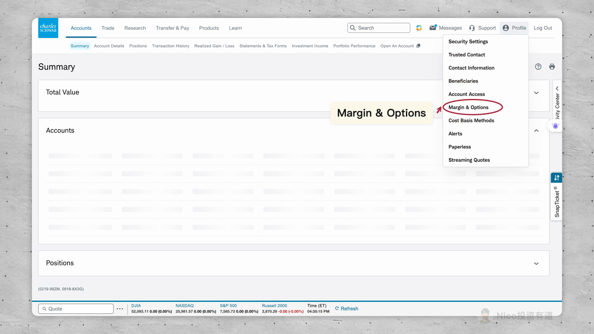

往下可以看到四档期权权限。我直接申请了最高一档，也就是风险最大的一档。

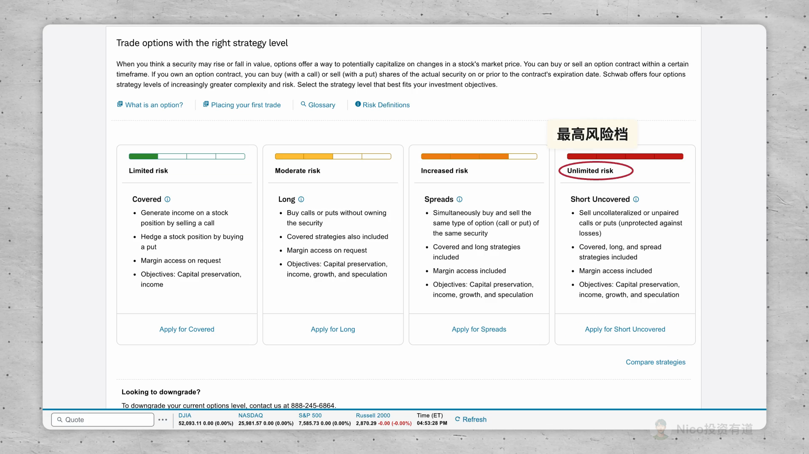

进入申请界面之后，可以看到交易经验、职业状况、财务状况，以及最后的信息核对这四个部分。我们先看 **Trading Profile**，也就是交易经验，第一个是股票交易经验。

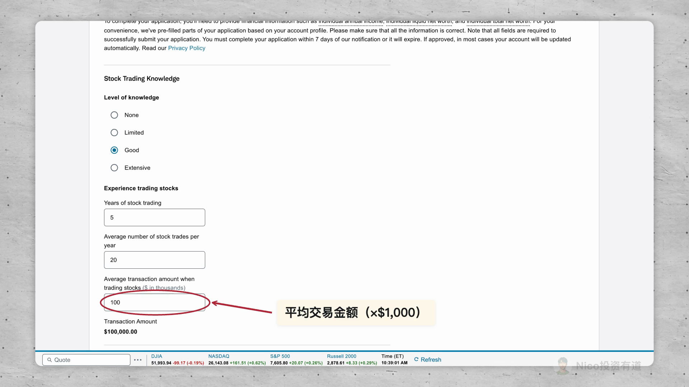

第二个是期权交易经验，第三个是债券交易经验，后两项是商品和其他金融资产的交易经验。全部如实填写完成之后，点击 **Continue**。

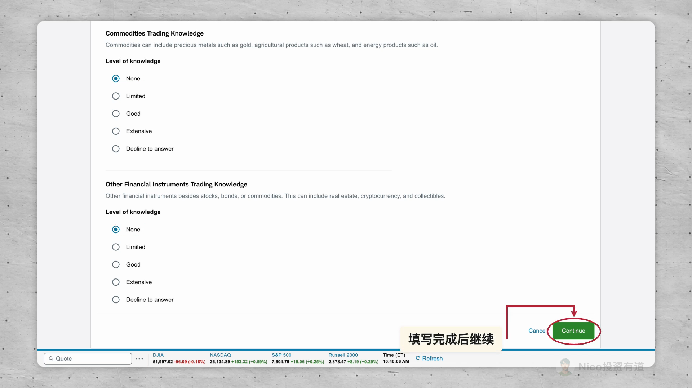

接下来就是填写职业信息。这里会直接显示你之前开户的时候填写的信息内容，下面的地址信息，也如实填写就可以了。

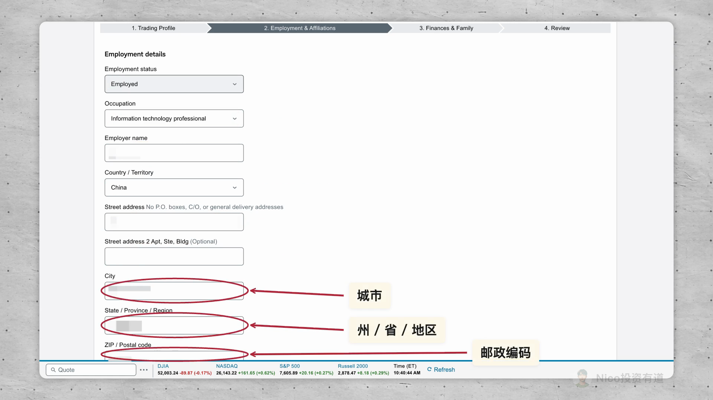

然后就是 **Affiliation** 选项，问你是不是美国上市公司的董事或者高管，有没有相关券商或者交易所从业关联。一般就选择 **No**，填写完成后，点击下面的 **Continue**。

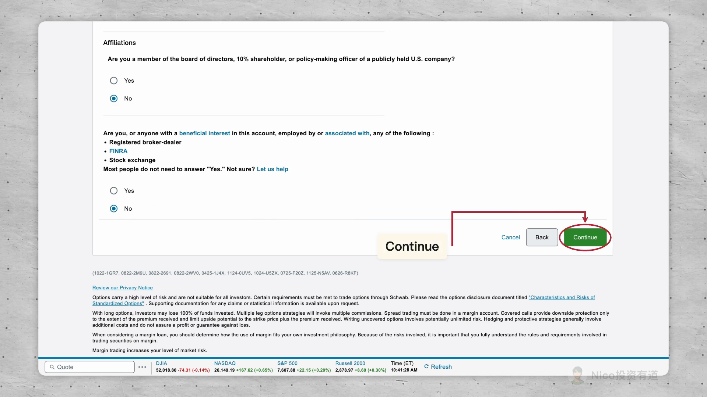

接下来继续填写婚姻关系以及抚养人数量。没有需要申报的抚养人时，才填 0。下面的财务状况，按照自己的真实收入、净资产和流动资产填写，然后点击 **Continue**。

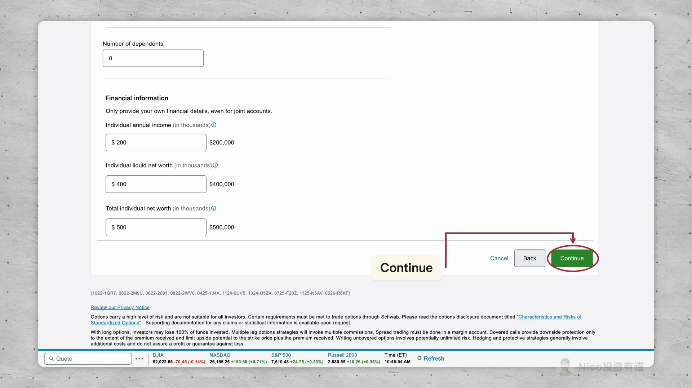

最后就是核实一下信息，没问题的话，点击底部的 **Continue**。

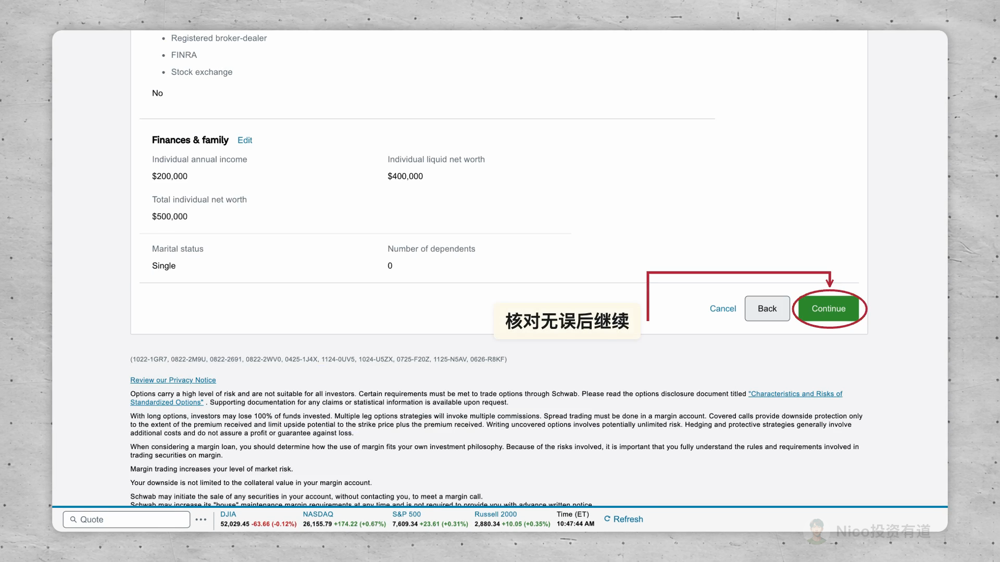

接着，我们需要阅读并勾选同意两个协议，然后点击 **Submit**。

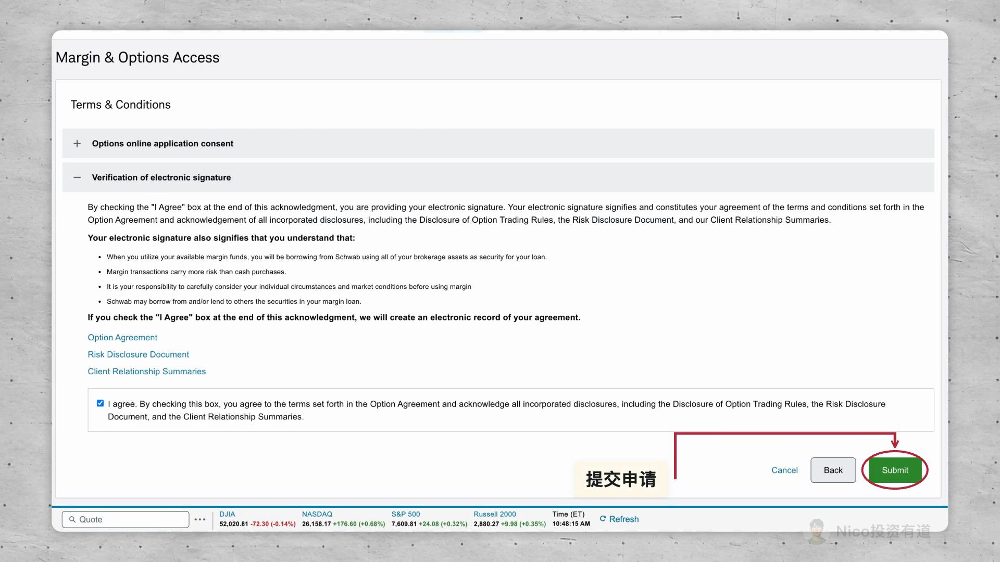

到此为止，就成功提交嘉信期权的开通申请了。

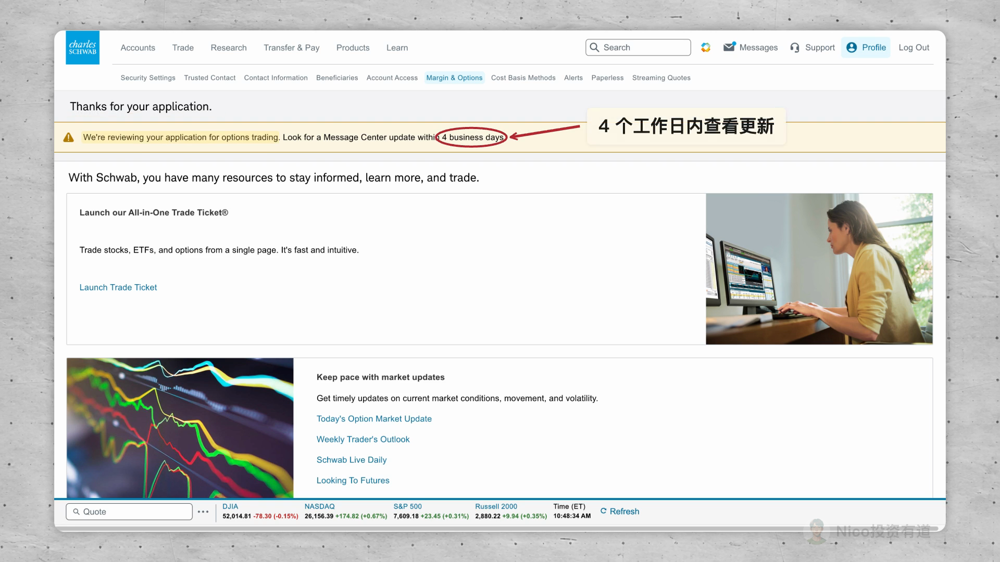

按照我之前的经验来看，当场提交，当场就会给结果，只不过最后的等级可能和你申请的等级不同。

我这里拿到的期权等级是第三档，可能是填写的交易经验或者资产情况，没有达到最高档的要求。不过，这个等级的期权暂时够用了，只是不能在没有保护的情况下直接裸卖期权。

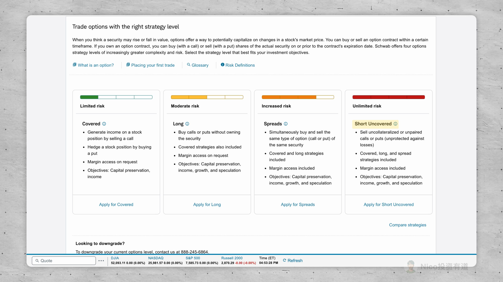

## 4. Thinkorswim 看懂期权链

接下来，我们所有的操作都会在 thinkorswim 这个 App 上面完成。如果你不了解这个 App 的话，可以参考我之前做的[嘉信理财从 0 到 1 入门教程](https://invest-nav.com/tutorials/us-brokers/text/charles-schwab-thinkorswim-guide/)，快速学习一下。

进入 thinkorswim 主页之后，点击右上角的搜索按钮。这里，我就以**英伟达（NVDA）**这只股票作为案例给大家演示。

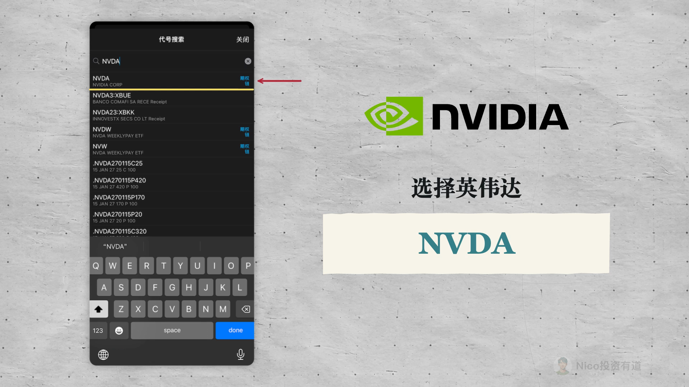

进入行情界面之后，切换到期权选项，先看上面这一排的四个指标。

第一个是**隐含波动率**，就是我们前面讲过的 IV，反映期权市场对于英伟达未来波动幅度的预期。

第二个是隐含波动率再加一个百分比符号。它主要是看英伟达当下的 IV，相比起过去一年的水平，是高还是低。截图显示 23%，说明相对于过去一年的历史范围，现在的 IV 处在相对低的水平。

第三个是 **VWAP**，中文名叫做成交量加权平均价。简单理解，就是把当天股票的成交价格，按照成交量加权算出来的平均价。

最后一个是历史波动率再加一个百分比符号，截图显示 88%，说明最近英伟达的实际波动，在最近一年的范围里面，处于比较高的水平。历史波动率的英文简称是 **HV**。

大家记住一点：**IV 是市场对于未来波动的预期，HV 则是实际产生的历史波动水平**；而带百分号的这两个相对指标，则是在历史范围内做纵向比较。

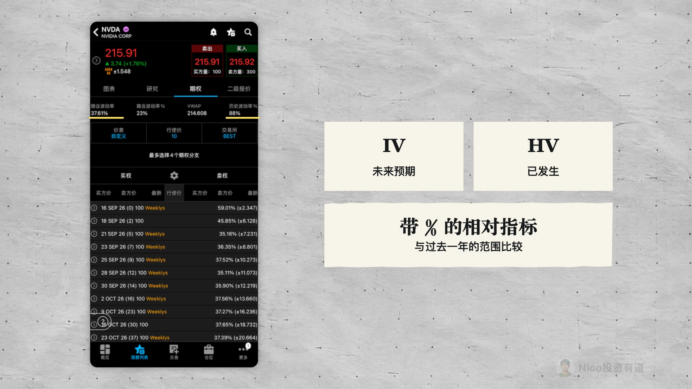

接下来一行有“价差”“行使价”“交易所”三个设置，我们只需要关注“价差”这个选项就可以了。点击它，会看到有自定义、单支策略、垂直策略、蝶式策略等很多个选项。

我们今天只讲**单支策略**，一般也叫做**单腿策略**。其他策略今天暂时不展开，等之后我做系统性美股期权教程的时候，再和大家详细说。

这里，我们直接选择单支策略。它的意思就是，单笔订单只交易一种期权，比如说单独买入某个 Call 或者某个 Put，而不是在一笔订单中同时组合多个不同的期权合约，做价差等策略。

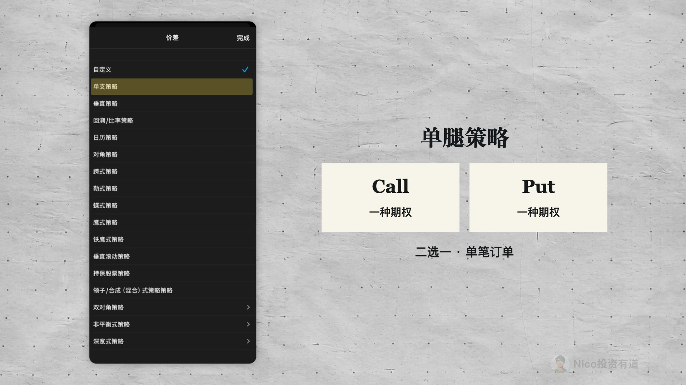

接着，我们继续往下看。左边写着**买权**，对应的就是 Call 看涨期权；右边写着**卖权**，对应的就是 Put 看跌期权。不要被这里的中文翻译迷惑，Call 和 Put 都可以被买入，也都可以被卖出。今天我们只讲买方视角，买 Call 或者买 Put。

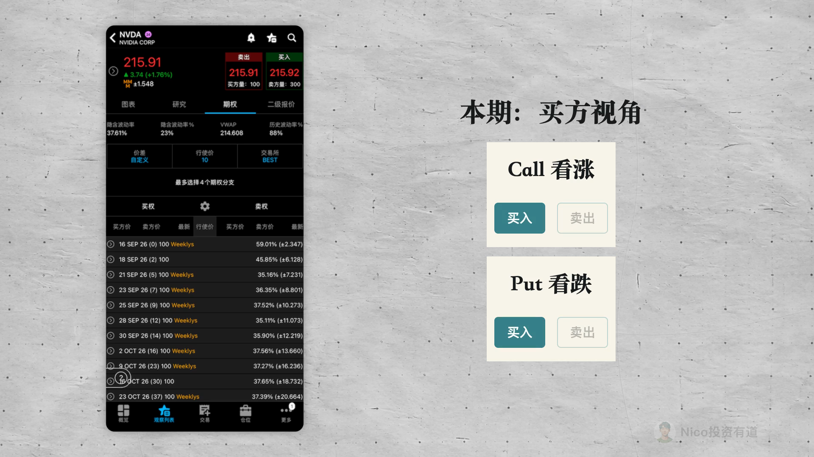

下面的每一行日期，代表一组相同到期日的期权。比如说 **2 OCT 26**，就是指 **2026 年 10 月 2 日**到期；括号里的 **16**，表示截图当时距离到期日还有 16 天；后面的 **100**，就是指一张期权对应 100 股股票。

每个日期右边还有一组数字。比如说这一行的 **37.56%**，是这个到期日对应的 IV；旁边的 **±13.66**，则是市场当时预期的波动幅度，大约在上下 13.66 美元。

但这只是市场当下的预期，数字每分每秒都会发生变化，最后实际的股价波动，也可能会超出这个范围。

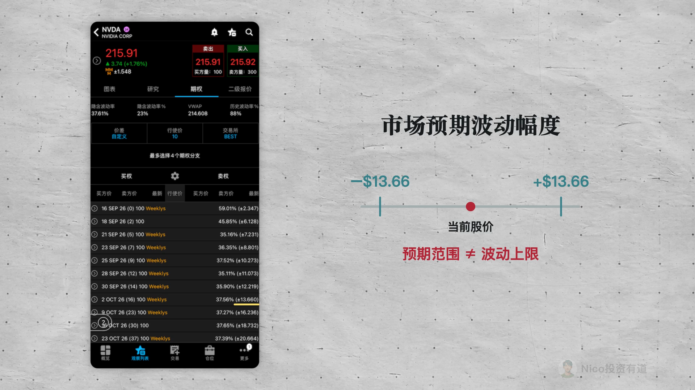

我们就以这组期权举例，点击它展开。中间这一列就是**行使价**，也就是前面讲过的行权价，比如 215、217.5、220 美元。同一行左边是这个行权价的 Call，右边则是这个行权价的 Put。行权价放在中间，Call 和 Put 左右对称，很好理解。

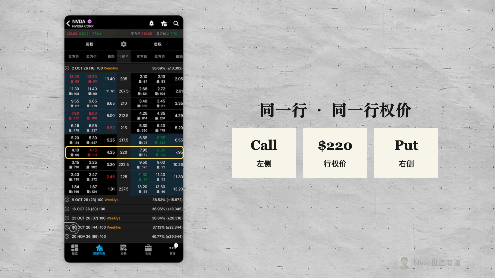

左右两边都有“买方价”“卖方价”和“最新”这三个报价。**买方价（Bid）**，意思就是市场上所有买家当前愿意出的最高价格；**卖方价（Ask）**则是反过来，意思是市场上所有卖家此时此刻能接受的最低价格。

如果你想买入，就先看卖方价。还是以 **220 这一行的 Call** 为例，买方价是 **4.10 美元**，卖方价是 **4.15 美元**。如果按 4.15 美元的价格成交一张，需要支付的权利金就是 **415 美元**。

你也可以挂一个更低的限价，等待有人愿意按这个价格卖出，再成交。这和我们买卖股票的道理是完全一致的。报价会变动，挂单不等于一定成交。

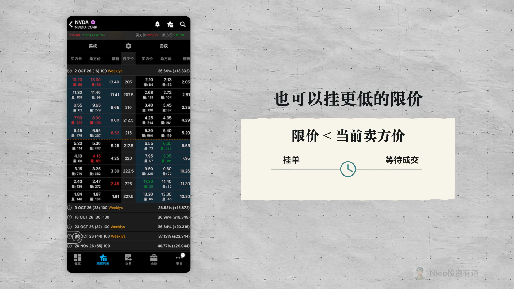

然后，我们再看表格中间的这条**黄色虚线**，它标出了当前股价所在的位置。截图中，英伟达的股价是 **215.69 美元**，这条线就在 215 和 217.5 两档行权价之间。带蓝色底色的是实值期权，黑色区域则是虚值期权。到此为止，关于期权链上需要知道的基础常识，我们就全都讲完了。

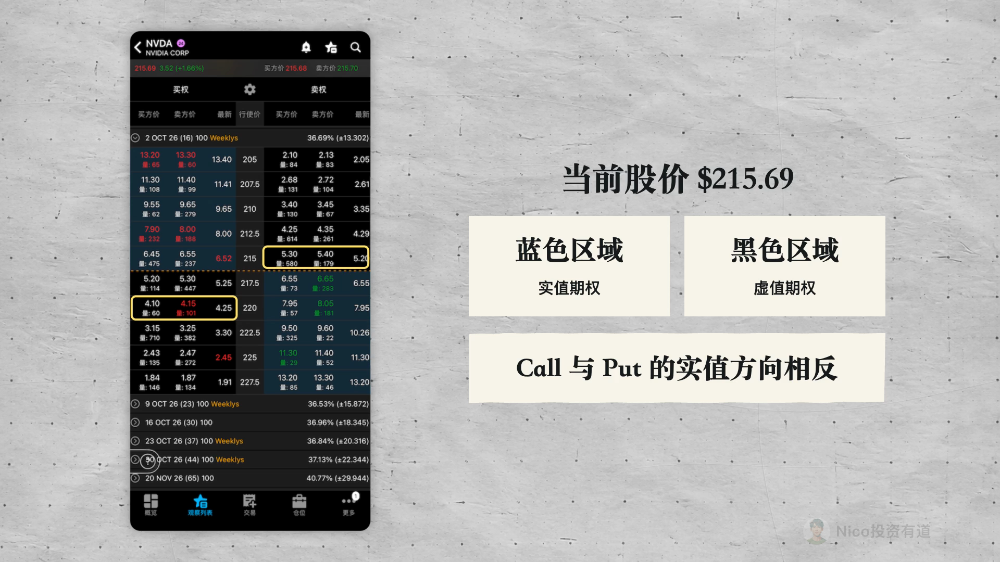

## 5. Thinkorswim 实战演示

接下来，我就给大家实际演示一下，如何下单一张 Call。就以 **220 这一行的 Call** 为例，点击**卖方价格**对应的那个数字。

进入下单界面之后，上面的这串符号，就是指英伟达 **2026 年 10 月 2 日到期、行权价 220 美元的 Call**。“添加期权分支”这个按钮，我们用不到，因为今天我们只交易这一种 Call，不搭配其他期权。

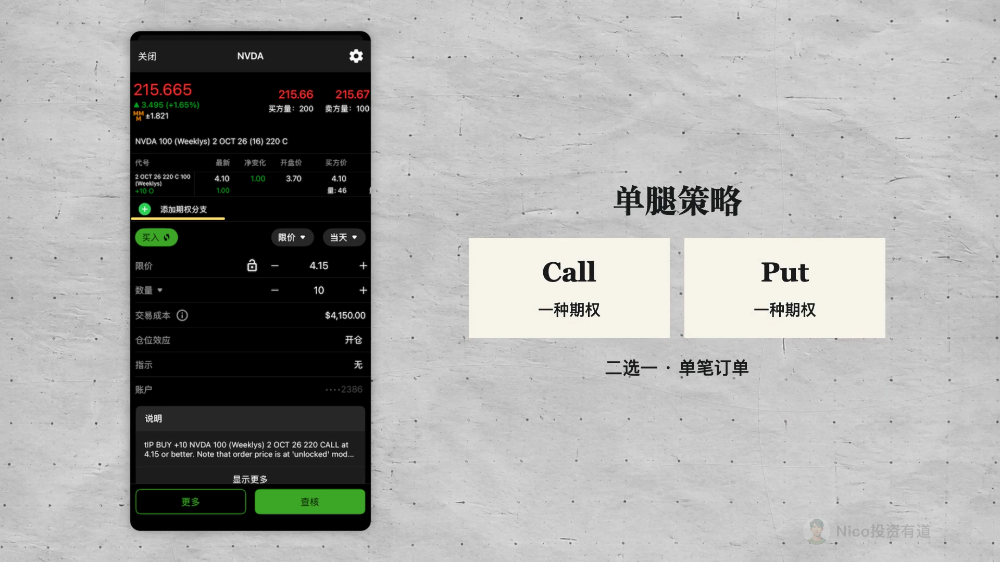

右边分别是**订单类型**和**有效期**。点击之后，可以看到市价、限价、止损，以及当天、取消前有效这些选项。这些在上期嘉信理财从 0 到 1 入门的教程中，我们已经详细讲过了，大家可以回去看一下。今天我们就直接使用**限价单**，也就是最常用的一种订单类型，输入自己能够接受的买入价格。

接下来这个**数量**，一定要看清楚。默认显示的是 **10**，也就是买入 10 张期权，对应的权利金成本是 **4,150 美元**。今天我们只买入一张期权，数量改成 **1**，对应的权利金就是 **415 美元**。都填好之后，我们点击**查核**按钮。

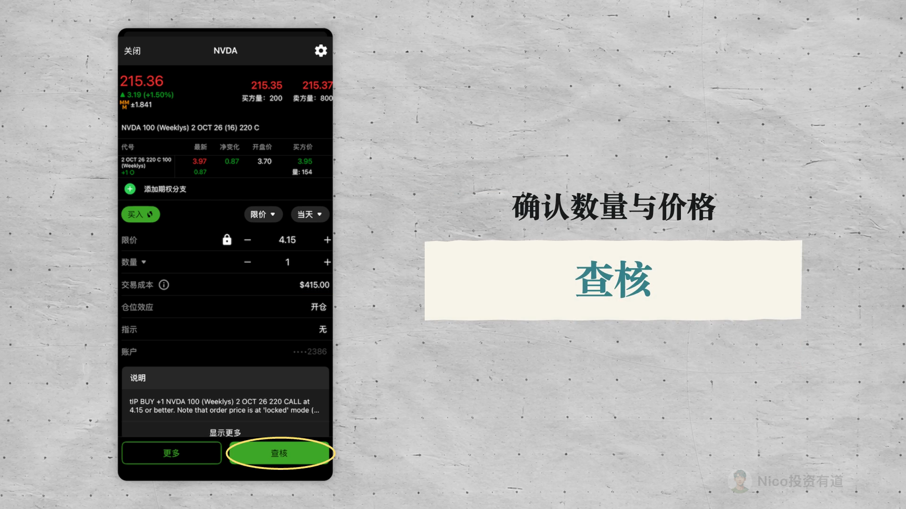

可以看看这里显示的交易费用。嘉信理财的美国交易所上市股票，标准线上交易佣金为 0；交易期权，每张会收取 **0.65 美元**的合约费。

除此之外，还有 **0.01 美元**的期权监管费用。算下来也不是特别贵。

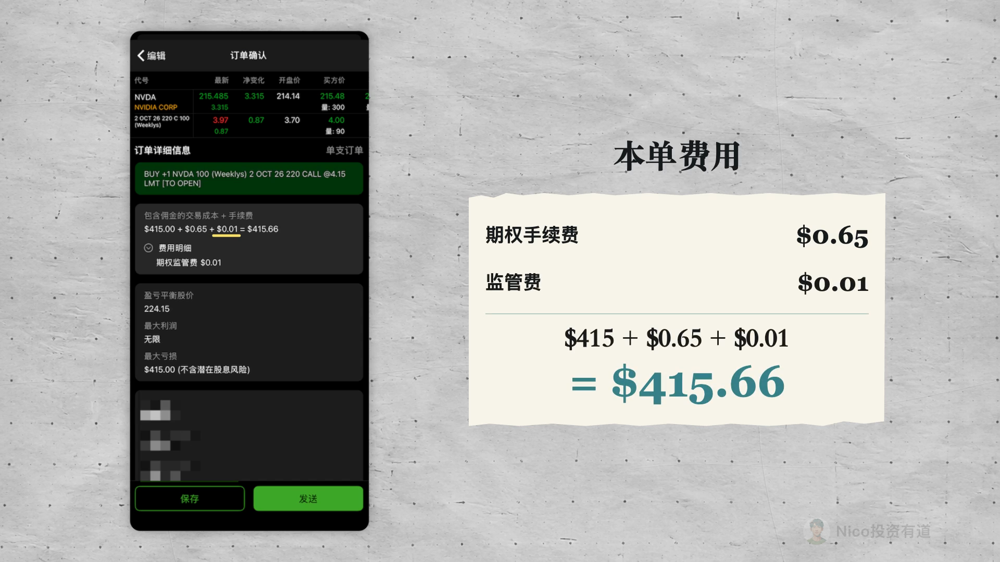

再往下，嘉信也会给你计算出这张期权的**盈亏平衡价、最大利润、最大亏损**。

对于这里单独买入的这张 Call，理论最大利润没有上限，因为股价理论上可以不断上涨；最大亏损则是买入期权所支付的权利金，再加交易费用。

这里要区分 Call 和 Put：单独买入 Put 的最大收益有上限，因为股票最低只能跌到 0；单独买入 Call 或 Put，期权本身的最大亏损都是已付权利金及费用。卖方也不能一概而论，裸卖 Call 理论损失无上限，而卖 Put、备兑 Call、价差组合的风险边界各不相同。本文这一单演示的是买入 Call。

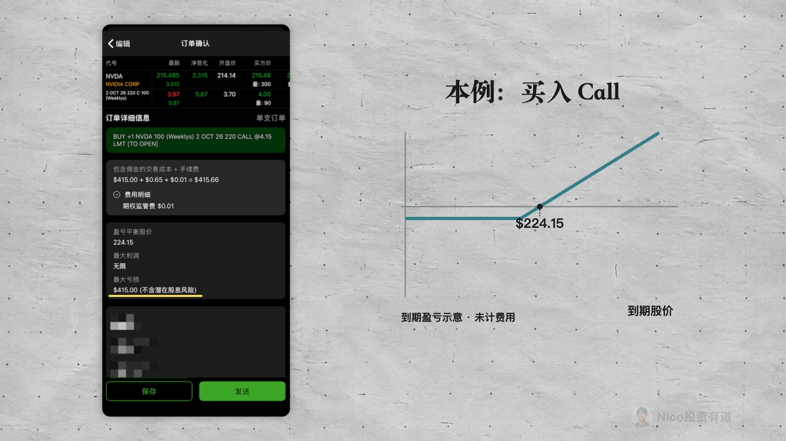

接下来，我们点击下方的**发送**按钮。回到订单页面，就可以看到刚才下的这笔期权订单已经顺利成交了。

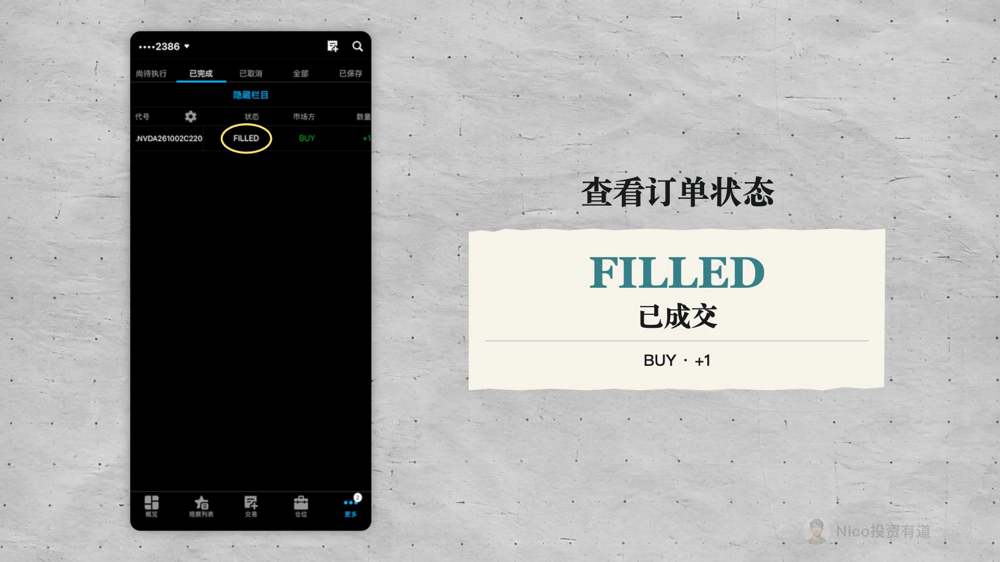

接下来，我再给大家快速演示一下，如何卖出这张看涨期权。点击下方的**仓位**按钮，就可以看到刚刚买入的这笔期权的仓位，点击它。

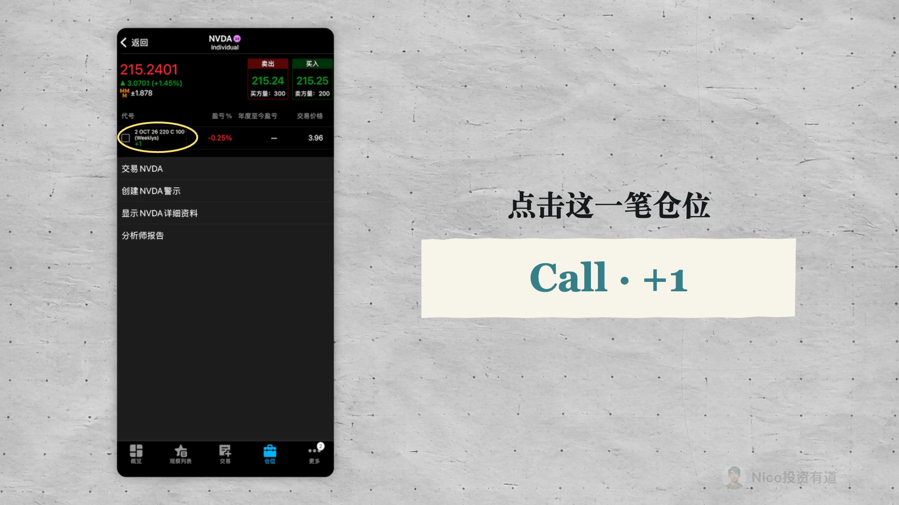

然后，继续点击下方的**平仓**。剩余的填写价格、查核和发送流程，就和之前买入期权相似，但这里是卖出已有持仓、卖出平仓。

到此为止，关于嘉信理财期权的买卖流程，我们就全部演示完了。

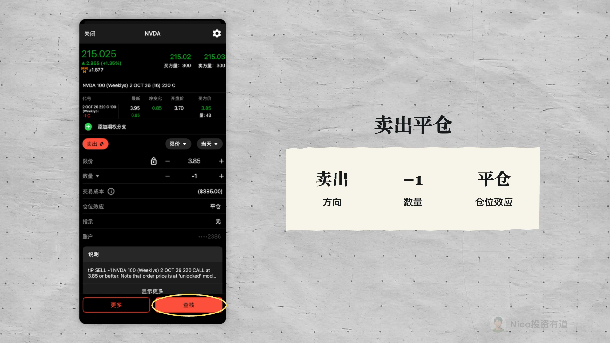

## 6. 写在最后

对于刚开始接触美股期权的朋友来说，尤其是使用嘉信理财这种我觉得 UI 比较难上手的 App，我建议大家可以多使用模拟账户，多操作几遍。当然，最重要的一点，还是先学习、理解清楚期权的基本概念，然后再去实际操作。

接下来几个月，我还会陆续做一些更加进阶的美股期权实战教程。

除此之外，关于嘉信理财系列，我应该还会做一期出金教程。

最后，如果你觉得嘉信理财期权功能实在难用的话，也可以考虑了解一下复星券商。它的期权链做得非常简洁，刚才我们讲到的很多数据，在这里都能直观看到，一目了然。对于刚开始接触期权的朋友来说，会更容易上手一些。

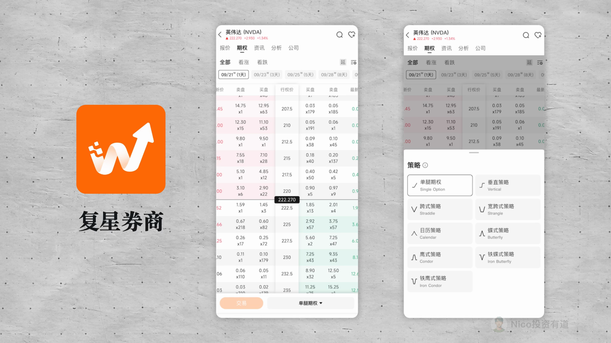

目前复星的开户门槛也非常低，使用海外 IP + 身份证就可以成功开户，对于大陆用户来说很友好。注意在打开开户链接的时候，一定要切换到全局 IP 模式。

新用户入金之后，还可以享受终身免佣以及股票现金卡返现的福利。

- 复星开户教程：https://invest-nav.com/tutorials/us-brokers/text/fosun-securities/
- 复星专属开户链接：https://h5.fotechwealth.com/pages/startAccount.html?channel=030003&aeCode=B2&invitationCode=PWZYR2&langType=zhCn

---

以上就是本篇教程的全部内容，欢迎大家点赞、收藏、转发，感谢支持🙏

我的投资导航网站，收录过往的文字教程，提供好用的投资工具，供大家从 0 到 1 一站式学习和检索：

https://invest-nav.com

⬇️ 如下平台，分享美股投资、加密投资、AI 体验、香港/境外银行、出入金、资金流转等经验心得、实操分享，欢迎关注：

X 账号：https://x.com/tychozzz

Youtube 频道：https://www.youtube.com/@NicoGrowthz
