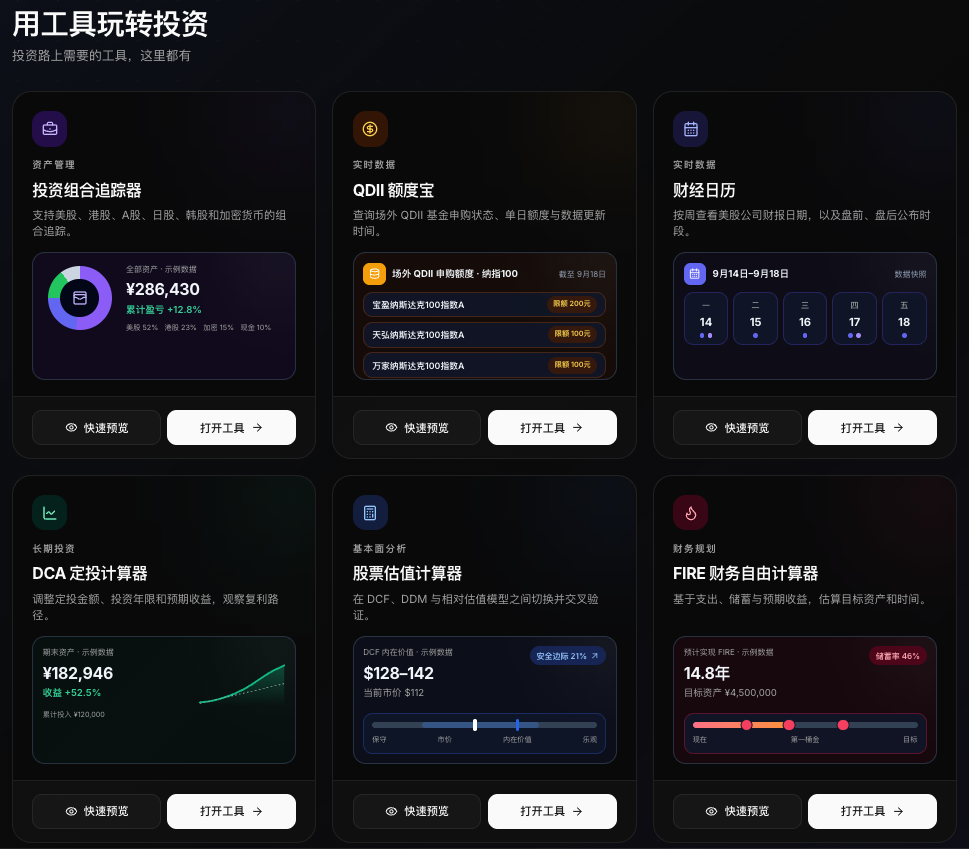

<h1 align="center">Nico 投资指南</h1>

<p align="center"><strong>Nico’s Investment Guide</strong></p>

<p align="center"><strong>面向大陆用户的美股与加密货币投资入门指南</strong></p>

<p align="center">
  <a href="https://invest-nav.com/"></a>
  <a href="https://www.youtube.com/@NicoGrowthz"></a>
  <a href="https://x.com/tychozzz"></a>
</p>

<p align="center">
  <a href="#start">从这里开始</a> ·
  <a href="#guides">教程导航</a> ·
  <a href="#tools">用工具</a> ·
  <a href="#videos">看视频</a> ·
  <a href="#about">关于作者</a>
</p>

## 📈 Nico 投资指南：从 0 到 1 入门美股与加密投资

疫情之后美股 AI 牛市启动，三四年时间过去，标普纳指已经从低点翻倍，无数 AI 相关的股票涨了几倍甚至是 10 倍以上。在此期间，也有无数新手小白涌入美股，想要从中分一杯羹…

然而对于大陆用户来说，投资美股，并不是如投资 A 股一般简单，中间隔着非常多障碍。

比如说如何开通境外银行账户、如何跨境汇款、如何开通美股券商账户、如何完成出入金，等等一系列问题。

很多人在刚开始入门的时候，总是一头雾水，不知道从哪一步开始。市面上的各类教程也良莠不齐，割韭菜居多，一些朋友还没有开始投资，就被骗子掏空了腰包，得不偿失，只能黯然离场…

今天我结合自己过去几年的实操经验，整理出一套全网最详细最全面的专门面向大陆用户的投资指南。

涵盖香港银行开户、美股投资、加密货币投资、出入金资金流转等所有常见的主题。

涵盖你在投资入门过程中，所有需要提前想清楚的理念、提前准备的工具、提前注意的事项。

让你不仅知道“怎么做”，还要知道“为什么这么做”，帮助你真正从 0 到 1 入门。

你可以按照主题阅读，也可以直接全局搜索当前需要解决的问题。

如果你喜欢网站阅读，可以前往 [投资导航](https://invest-nav.com/)；喜欢跟着视频学习，可以看我的 [YouTube 频道](https://www.youtube.com/@NicoGrowthz)。

> GitHub 项目、网站、YouTube 频道持续更新中，欢迎大家持续关注更多干货内容…

> 本项目仅分享个人经验心得，不构成任何投资建议，在具体实操之前，请务必结合自己的实际财务情况。

<a id="start"></a>

## 从这里开始

第一次阅读，先打开 [开始阅读](./00-开始阅读/README.md)，了解这份指南的使用方式。

| 你的目标 | 建议阅读顺序 |
| --- | --- |
| 从零了解美股投资 | 美股投资（香港境外银行 → 美股券商）→ 按需阅读出入金 → 美股 ETF；暂不开境外账户可先看美股 QDII 基金 |
| 从零了解加密货币 | 加密货币基础 → 交易所 → 按需阅读加密货币虚拟卡与出入金 |
| 已经有账户，寻找具体步骤 | 直接进入对应二级分类，核对教程的适用条件和更新时间 |

这是阅读顺序。具体账户、材料和操作步骤，以所选教程说明的条件为准。

<a id="guides"></a>

## 教程导航

### 01 · 美股投资

| 二级分类 | 仓库目录 |
| --- | --- |
| 01 · 香港境外银行 | [进入](./01-美股投资/01-香港境外银行/README.md) |
| 02 · 美股券商 | [进入](./01-美股投资/02-美股券商/README.md) |
| 03 · 美股 QDII 基金 | [进入](./01-美股投资/03-美股QDII基金/README.md) |
| 04 · 美股 ETF | [进入](./01-美股投资/04-美股ETF/README.md) |

### 02 · 加密货币

| 二级分类 | 仓库目录 |
| --- | --- |
| 01 · 交易所 | [进入](./02-加密货币/01-交易所/README.md) |
| 02 · 加密货币基础 | [进入](./02-加密货币/02-加密货币基础/README.md) |
| 03 · 加密货币虚拟卡 | [进入](./02-加密货币/03-加密货币虚拟卡/README.md) |

### 03 · 出入金 / 资金流转

| 二级分类 | 仓库目录 |
| --- | --- |
| 01 · 出入金 | [进入](./03-出入金与资金流转/01-出入金/README.md) |
| 02 · 海外电话卡 | [进入](./03-出入金与资金流转/02-海外电话卡/README.md) |

<a id="tools"></a>

## 用工具玩转投资

投资路上需要的工具，这里都有，全部免费，开箱即用，[点击进入投资导航网站](https://invest-nav.com/)。

- [投资组合追踪器](https://invest-nav.com/tools/portfolio-tracker/)：看清持仓、盈亏和资产配置
- [QDII 额度宝](https://invest-nav.com/tools/qdii-quota/)：先确认今天还能买多少
- [财经日历](https://invest-nav.com/tools/earnings-calendar/)：提前安排本周财报研究
- [DCA 定投计算器](https://invest-nav.com/tools/dca-calculator/)：把定投计划换算成长期结果
- [股票估值计算器](https://invest-nav.com/tools/valuation/)：比较市价与内在价值假设
- [FIRE 财务自由计算器](https://invest-nav.com/tools/fire-calculator/)：算出财务自由还需要多久

<a href="https://invest-nav.com/#home-investment-tools">
  
</a>

<a id="videos"></a>

## 看视频学投资

不想看文字教程？直接跟着视频一步步操作。

[YouTube 频道「Nico 投资有道」](https://www.youtube.com/@NicoGrowthz)长期分享开户、出入金以及美股加密投资实操讲解，每周 1-2 更，欢迎持续关注。

<a href="https://www.youtube.com/@NicoGrowthz">
  
</a>

## 仓库结构

```text
invest-guide/
├── README.md
├── assets/
├── 00-开始阅读/
├── 01-美股投资/
│   ├── 01-香港境外银行/
│   ├── 02-美股券商/
│   ├── 03-美股QDII基金/
│   └── 04-美股ETF/
├── 02-加密货币/
│   ├── 01-交易所/
│   ├── 02-加密货币基础/
│   └── 03-加密货币虚拟卡/
├── 03-出入金与资金流转/
│   ├── 01-出入金/
│   └── 02-海外电话卡/
└── 04-常见问题/
```

一级分类对应一条学习主线，二级分类是具体主题。每个分类文件夹中的 `README.md` 是该分类的入口。教程整理后，会按 `01-教程名称.md`、`02-教程名称.md` 的方式依次存放在所属二级分类中。

<a id="about"></a>

## 关于作者

大家好，我是 Nico。美股/比特币长期投资者，长期定投可能是普通人财富自由的最简单方式。

持续分享长期投资观念、投资策略、投资心得、跨境投资攻略。

长期关注 [X](https://x.com/tychozzz)、[YouTube](https://www.youtube.com/@NicoGrowthz)、[Telegram](https://t.me/nicoinvestmentfriends)，一起实现财富自由。

## 内容使用说明

本指南仅用于个人经验心得分享，不构成任何投资建议。在具体实操之前，请务必结合自己的实际财务情况、投资目标和风险承受能力，独立判断并谨慎决策。

本指南涉及的平台信息、开户条件、费用及操作流程可能发生变化，请以相关机构的最新官方说明为准，并遵守适用的法律法规。文中提及的平台、产品或服务，不代表对其安全性、可靠性或收益的保证。

投资有风险，可能损失部分或全部本金。本指南不承诺任何投资收益，请充分了解相关风险，并对自己的投资决策和操作负责。

如果需要教程转载或者商务合作，请联系我的商务邮箱：[nicoinvestmentzzz@gmail.com](mailto:nicoinvestmentzzz@gmail.com)。
